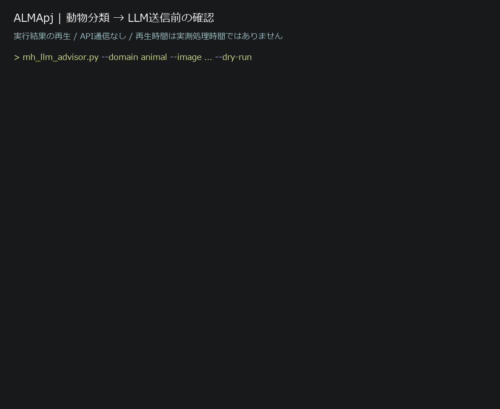
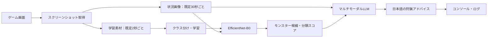

# ALMApj | モンスターハンター AI狩猟アドバイザー

**ゲーム画面を定期取得し、EfficientNet-B0で推定したモンスター名と画面画像をマルチモーダルLLMに渡して、狩猟アドバイスを生成するAI支援システムのプロトタイプです。**

画面取得・画像分類・文章生成を一つの処理フローとして統合することを目的に開発しています。ゲーム操作は自動化せず、プレイヤーの判断を補助します。30秒ごとの画像取得を用いる疑似リアルタイム方式であり、即時の回避操作を指示する用途は想定していません。

## 目的と設計

- ローカルの画像分類器でモンスター候補とスコアを取得する。
- 分類結果に加えて元のゲーム画面もLLMへ渡し、画面状況を踏まえた説明を生成する。
- 弱点属性、狙う部位、立ち回りなどを日本語で提示する。
- APIを呼ばない動作確認モードを用意し、各工程を段階的に検証する。

**鳥・ライオン・犬・猫の動物4クラス分類は、画像分類とLLM連携の動作確認用です。本番の目的はモンスターハンターの狩猟支援です。**

## 動作デモ・検証記録



実際の動物テストの出力を再生するGIFです。API通信・LLM文章生成・ゲームプレイ映像は含みません。再生の待ち時間は演出用で、実測処理時間ではありません。[出力全文](docs/demo-output.txt)と[評価結果・再実行手順](docs/EVALUATION.md)を公開しています。

手元のデータで動物200枚・モンスター1,137枚の分類を測定しました。学習データとの重複があるため、未知のゲーム画面に対する精度の実績としては扱いません。

## 処理フロー



学習素材はモンスター名ごとのフォルダに手動で分類してから学習します。状況画像は保存先の新規画像を監視して処理します。助言が表示されるまでには、撮影間隔に加えて分類・API通信・生成の時間がかかります。

## 使用技術

| 技術 | 用途 |
| --- | --- |
| Python 3.10以上 | 画面取得、学習、推論、各工程の連携 |
| PyTorch / torchvision | EfficientNet-B0の学習・画像分類 |
| Pillow / PyAutoGUI | 画像処理・画面取得 |
| OpenAI Python SDK / Responses API | 推定結果と画像を入力する文章生成 |
| tqdm | 学習進捗表示 |
| FiftyOne / Open Images | 動物分類の検証用データ取得（任意） |
| VOICEVOX / Live2D / Electron | 音声・キャラクター表示の拡張（任意） |

LLMのコード上の既定モデルは `gpt-5.4-mini` です。`OPENAI_MODEL` または `--model` で変更できます。実行には利用可能なモデルとAPI利用枠が必要です。

## 主要ファイル

| ファイル・ディレクトリ | 役割 |
| --- | --- |
| `screenshot.py` | 学習素材と状況判断用の画像を別周期で保存 |
| `train.py` | ImageFolder形式のデータでEfficientNet-B0を学習、モデルを保存 |
| `predict.py` | 保存モデルで分類し、上位候補とスコアを取得 |
| `evaluate.py` | クラス別指標・混同行列・処理時間をJSONへ記録 |
| `mh_llm_advisor.py` | 画像分類とLLMを接続するCLI。単発・監視・動物テストに対応 |
| `mh_prepare_dataset.py` / `mh_dataset_report.py` | モンスターデータ用フォルダの準備・枚数確認 |
| `download_openimages_animals.py` | 動物4クラスの検証データを取得 |
| `mh_assistant/` | 狩猟セッション、プロンプト、知識情報、音声・表示の統合層 |
| `mh_hunt_agent.py` / `mh_run_assistant.py` | 拡張アシスタントの実行・複数プロセスの起動 |
| `mh_live2d_server.py` / `desktop_companion/` | Live2D表示サーバー・Electronウィンドウ |
| `requirements.txt` / `requirements-data.txt` | 通常実行用・データ取得用のPython依存関係 |

## セットアップ

以下はWindows PowerShellで、リポジトリのルートから実行します。基本フローにLive2DやVOICEVOXは不要です。

```powershell
git clone https://github.com/shupiwhite0203-bot/ALMApj.git
cd ALMApj
py -3.10 -m venv .venv
.\.venv\Scripts\python.exe -m pip install -r requirements.txt
```

Python 3.10以降を使用してください。GPUを利用する場合は、環境に合ったPyTorchを別途用意してください。

学習画像・スクリーンショット・学習済みモデル・実行ログは公開対象に含めません。新規クローンではデータを準備して学習する必要があります。既存のローカル環境では、手元のモデルをそのまま使用できます。

## 実行方法

### 1. データの準備と学習

```powershell
.\.venv\Scripts\python.exe mh_prepare_dataset.py
```

取得した画像を、次のように正しいクラスのフォルダへ配置します。現行の初期対象はレ・ダウ、リオレウス、リオレイア、アルシュベルド、チャタカブラです。

```text
data/monsters/
  レ・ダウ/
    image001.png
  リオレウス/
  リオレイア/
  アルシュベルド/
  チャタカブラ/
```

```powershell
.\.venv\Scripts\python.exe mh_dataset_report.py
.\.venv\Scripts\python.exe train.py --data-dir data\monsters --output-dir runs\monsters --epochs 20 --pretrained
```

各クラスに画像を用意してください。`--pretrained` の初回実行はImageNet学習済み重みをダウンロードします。学習後に `best.pt`、`last.pt`、`classes.json` が出力されます。通常の推論では `runs/monsters/best.pt` を使います。

### 2. APIなしで動物分類を確認

自分で用意した画像を `data/animals/鳥`、`ライオン`、`犬`、`猫` に配置します。任意の取得スクリプトを使う場合は、追加依存関係を入れて実行します。

```powershell
.\.venv\Scripts\python.exe -m pip install -r requirements-data.txt
.\.venv\Scripts\python.exe download_openimages_animals.py
```

取得スクリプトは各クラス最大50枚を取得し、出力先クラスフォルダの既存画像を削除してから配置します。自分の画像を保存している場合は実行前に退避してください。

```powershell
.\.venv\Scripts\python.exe train.py --data-dir data\animals --output-dir runs\animals --epochs 10 --pretrained --freeze-backbone
.\.venv\Scripts\python.exe mh_llm_advisor.py --domain animal --image "C:\path\to\animal.jpg" --dry-run
```

`--dry-run` は分類結果と送信予定のプロンプトを表示します。LLMによる文章生成は実行しません。動物分類の成功だけでは、ゲーム画面での分類精度を保証できません。

### 3. スクリーンショットと疑似リアルタイム監視

学習済みモンスターモデルを用意したあと、先に監視を開始します。

```powershell
.\.venv\Scripts\python.exe mh_llm_advisor.py --watch --dry-run
```

別のPowerShellで、同じリポジトリのルートから撮影を開始します。

```powershell
.\.venv\Scripts\python.exe screenshot.py --cnn-interval 2 --situation-interval 30
```

- 学習素材の保存先：`MonsterHunter_Screenshots/cnn_train/`
- 状況画像の保存先：`MonsterHunter_Screenshots/situation/`
- 撮影プログラムは起動直後にも撮影し、その後は指定周期で保存します。
- 監視は既定1秒間隔で確認し、起動時に存在した画像をスキップします。
- 動物画像を画面に表示して試す場合は、監視コマンドに `--domain animal` を追加します。
- 各プロセスは `Ctrl+C` で終了します。

### 4. LLMによるアドバイス生成

APIキーは環境変数で設定し、監視コマンドから `--dry-run` を外します。

```powershell
$env:OPENAI_API_KEY = "<自分のAPIキー>"
.\.venv\Scripts\python.exe mh_llm_advisor.py --watch
```

単発なら `--image "C:\path\to\screenshot.png"` を指定します。API呼び出しは課金対象で、画像と分類結果が外部APIへ送信されます。画面に個人情報を映さないようにしてください。APIキーをコード・ログ・コミットに含めないでください。

成功したアドバイスはコンソールに表示され、`runs/llm_advice/` に保存されます。

## 現在の実装範囲と制約

実装済みの範囲は、周期撮影、画像分類器の学習・推論、新規画像の監視、画像と推定結果を渡すLLM連携、文章表示・ログ保存、APIなしの動物テストです。拡張として狩猟セッション管理、知識情報の参照、VOICEVOX音声出力、Live2D表示、Electron起動のコードもあります。

これはプロトタイプです。[分類の実測記録](docs/EVALUATION.md)はありますが、未知データでの汎化性能、アドバイスの正確性、LLMを含む全体の応答時間は未評価です。分類スコアは正答確率を保証せず、対象外の画像にも既存クラスを返します。LLMは弱点や画面状況を誤って説明する可能性があります。監視は逐次処理のため、生成が撮影間隔より遅いと画像が滞留します。

音声・キャラクター表示の拡張手順は [mh_assistant/README.md](mh_assistant/README.md) を参照してください。VOICEVOX Engine、Live2Dモデル・ランタイム、Electronなどは別途準備が必要で、基本CLIと同じ再現性を保証するものではありません。

## 今後の改善点

- ゲーム画面のデータ拡充と、撮影セッション単位で分けた評価・クラス別精度の記録。
- 低スコア・対象外画像の判定と、誤分類時の助言抑制。
- 弱点情報の根拠確認、LLM出力の評価、APIエラー時の回復。
- 処理時間・API利用量の計測と、古い画像の滞留対策。
- デモ動画や実際の出力例の公開、拡張表示のセットアップ簡略化。

## 開発方法・データの扱い

実装には生成AIを活用しています。画面取得・分類・LLM連携のシステムを設計し、生成AIの支援を受けながらコードの検証・修正・統合を進めたプロジェクトです。

本プロジェクトは非公式の個人開発です。ゲーム画像、Open Imagesの画像、Live2D素材、音声・外部ランタイムにはそれぞれの権利・利用条件があります。公開リポジトリではローカルデータや第三者製バイナリを配布せず、利用者が条件を確認して準備する方式にしています。
